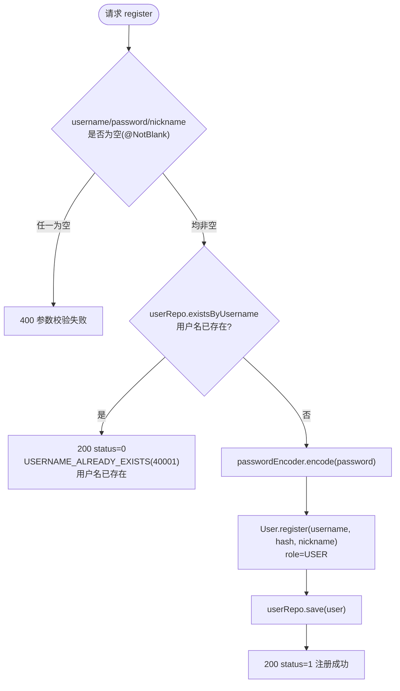
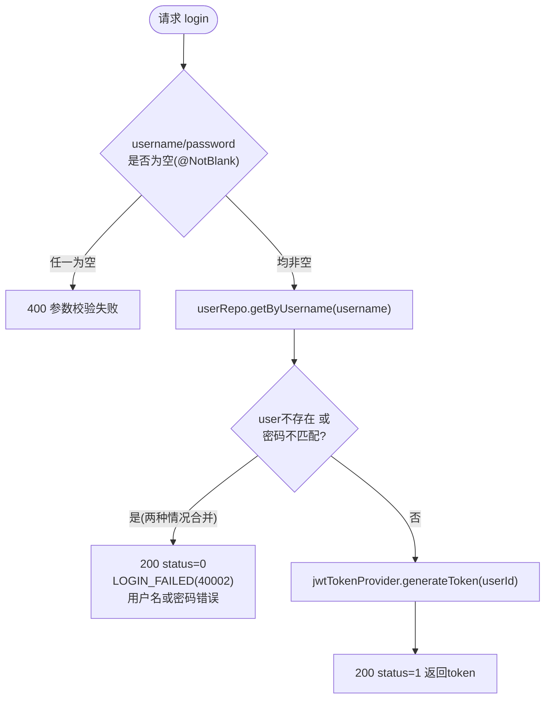
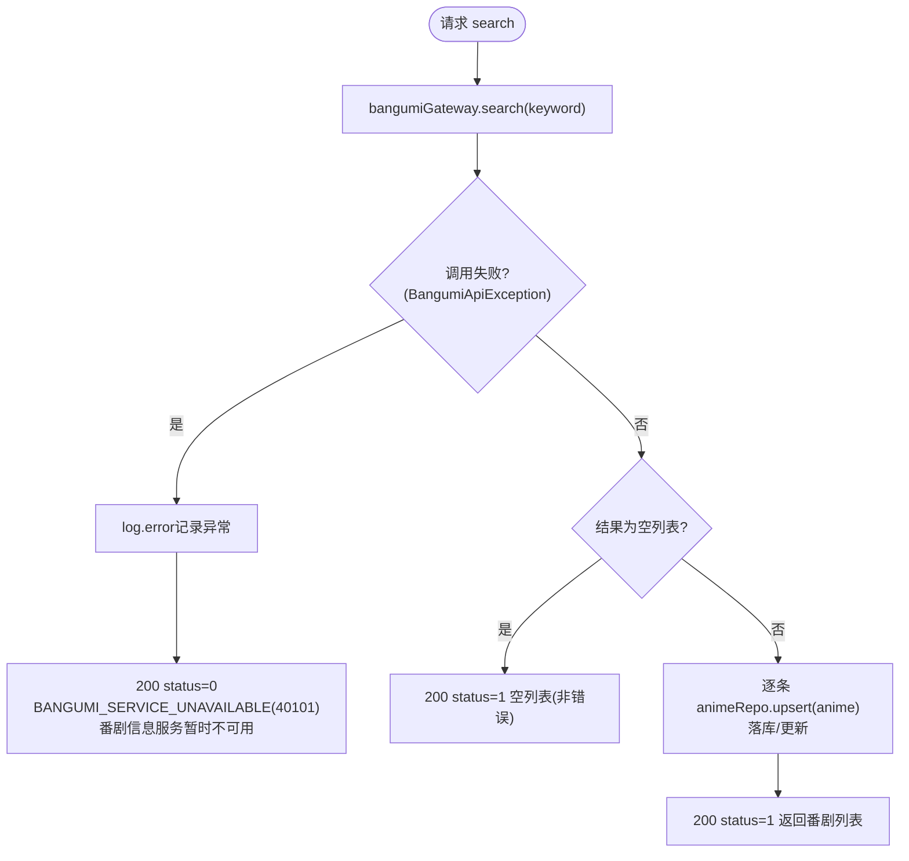
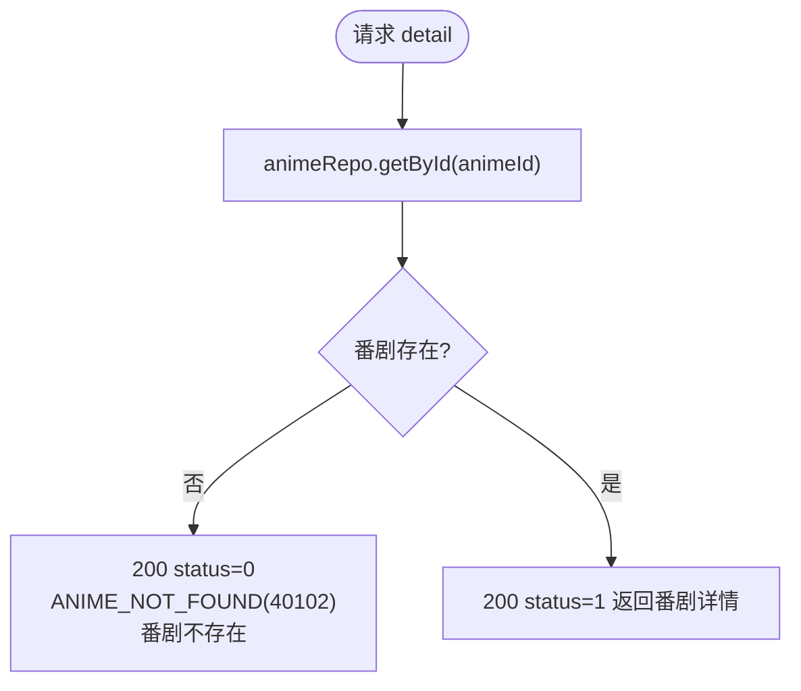
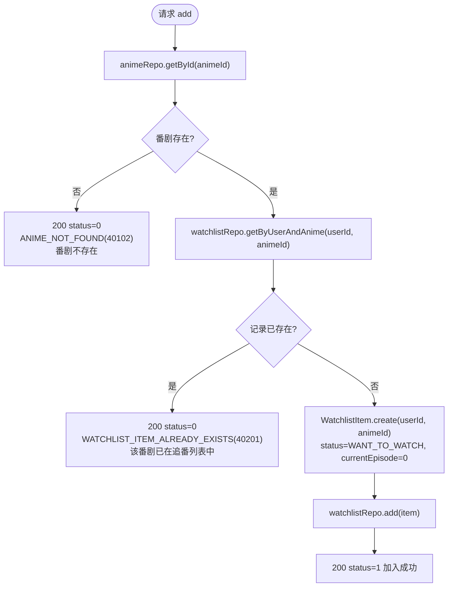
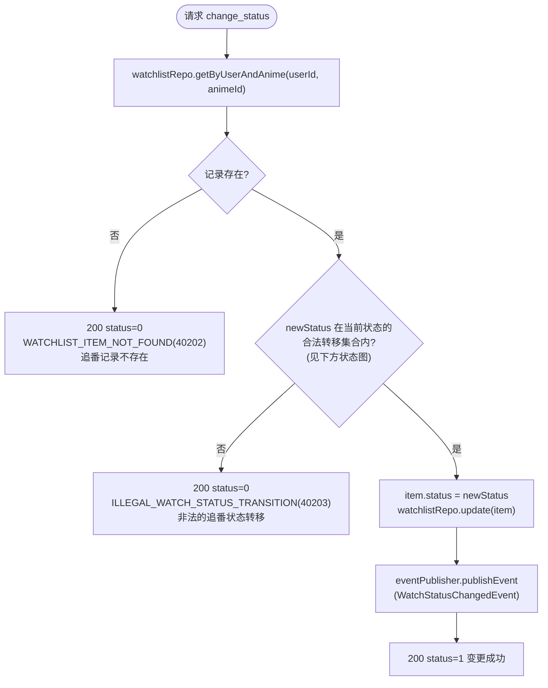
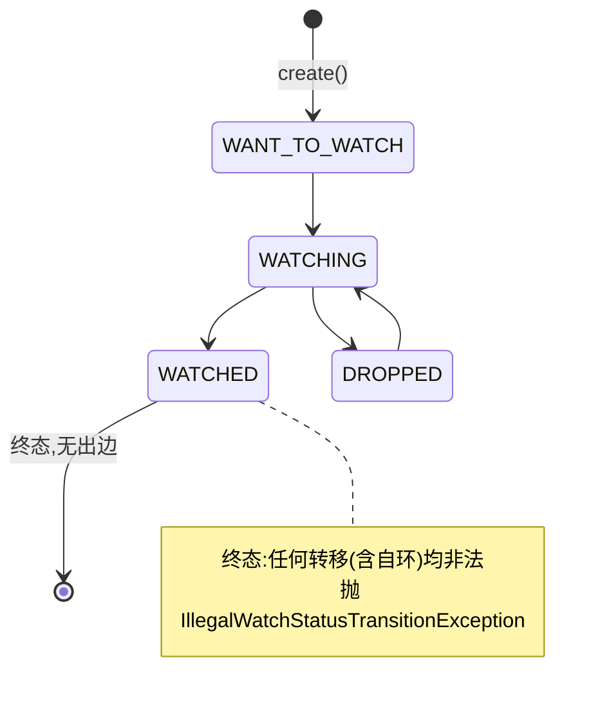
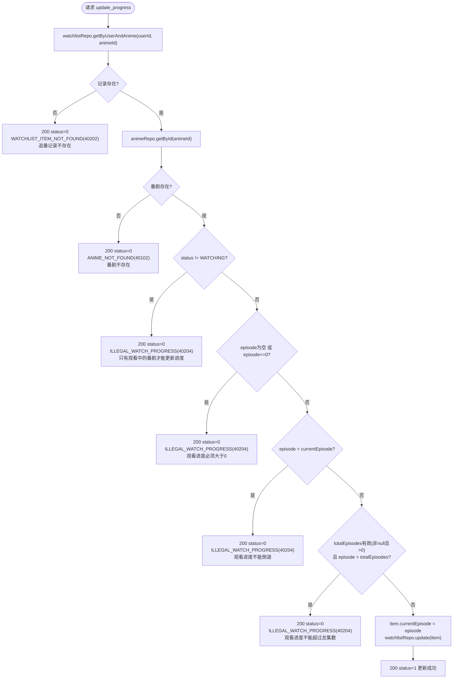
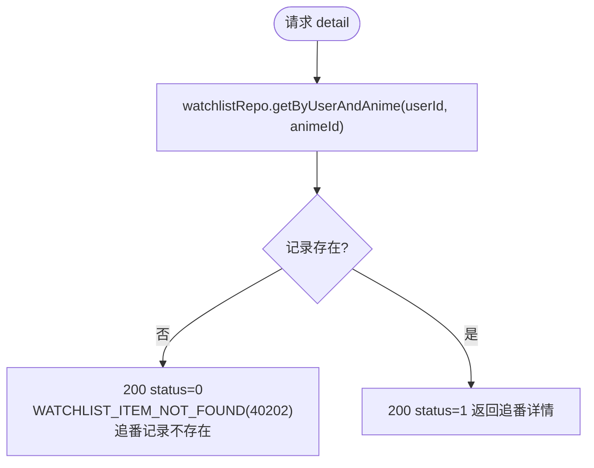
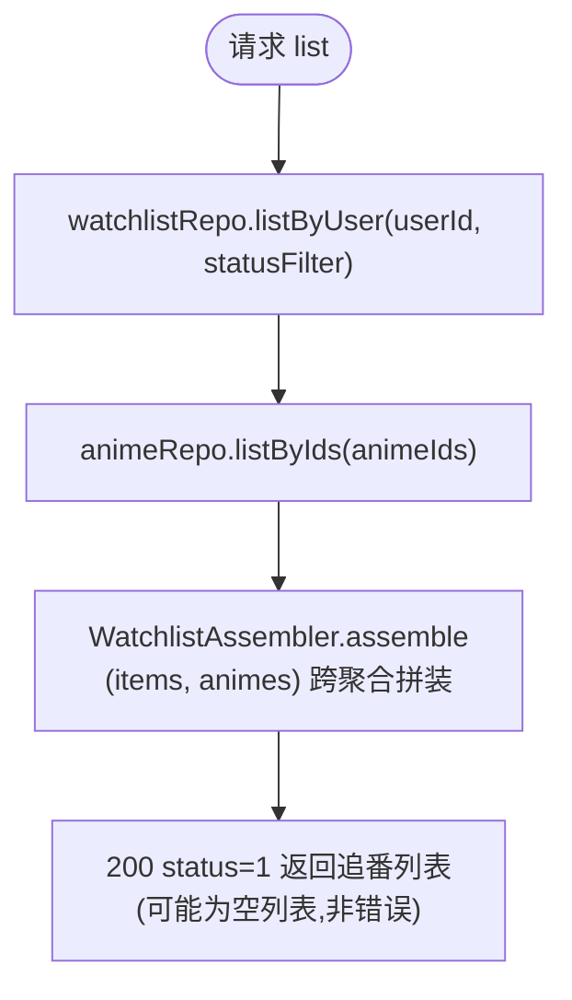

# anitrack 业务流程图

与 [anitrack-api-sequence.md](./anitrack-api-sequence.md) 互补:时序图展示接口的调用链路,本文档展示每个接口内部的业务决策/校验分支。

**通用约定**:除 `@Valid` 参数校验失败(如 `@NotBlank`)统一返回 **HTTP 400** 外,其余业务失败分支的 HTTP 状态码均为 **200**,靠响应体 `status=0` + `message` 区分成败(见各图终止节点标注)。

## User 用户上下文

### 注册 `POST /api/user/register`

### 登录 `POST /api/user/login`

> 注:用户不存在与密码错误对外表现完全一致(同一错误码/文案),避免用户名枚举。`User` 模型无账号状态字段,当前代码未实现锁定/禁用校验。

## Anime 番剧上下文

### 搜索并落库 `POST /api/anime/search`

### 查询详情 `POST /api/anime/detail`

> 注:仅查本地库,不存在时不会回退调用 Bangumi 网关兜底。

## Watchlist 追番上下文

### 加入追番 `POST /api/watchlist/add`

> 注:校验顺序是先查番剧存在性,再查重复追番。

### 变更追看状态 `POST /api/watchlist/change_status`

#### 追番状态机(合法转移关系)

### 更新观看进度 `POST /api/watchlist/update_progress`

> 注:与 add 相反,此接口校验顺序是先查追番记录、再查番剧存在性。四条进度校验按代码顺序短路执行,`episode == currentEpisode` 允许通过。

### 查询单条追番记录 `POST /api/watchlist/detail`

### 查询我的追番列表 `POST /api/watchlist/list`

