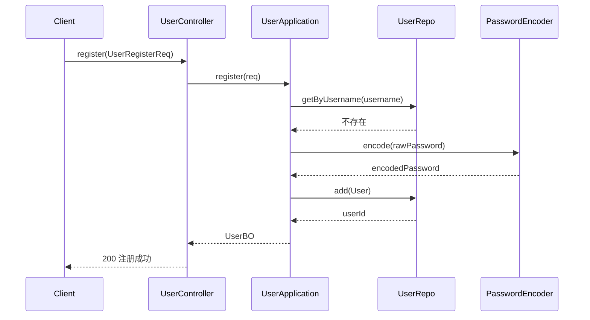
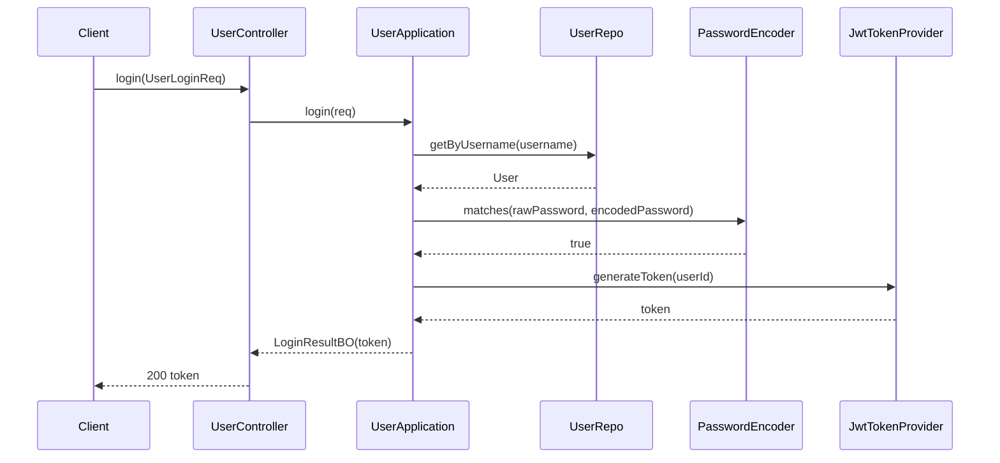
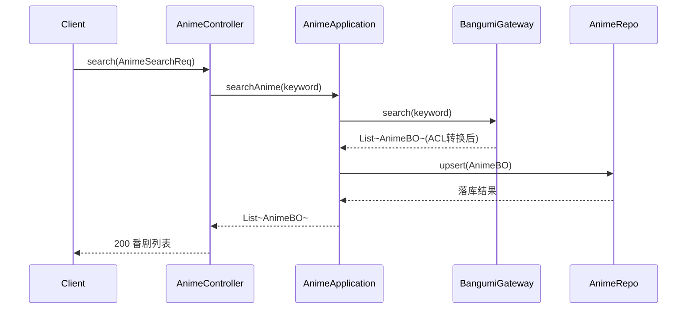
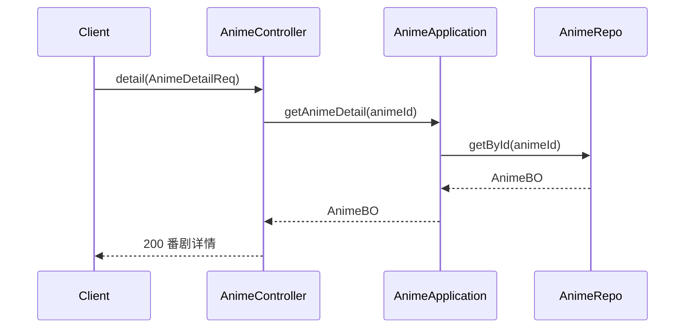
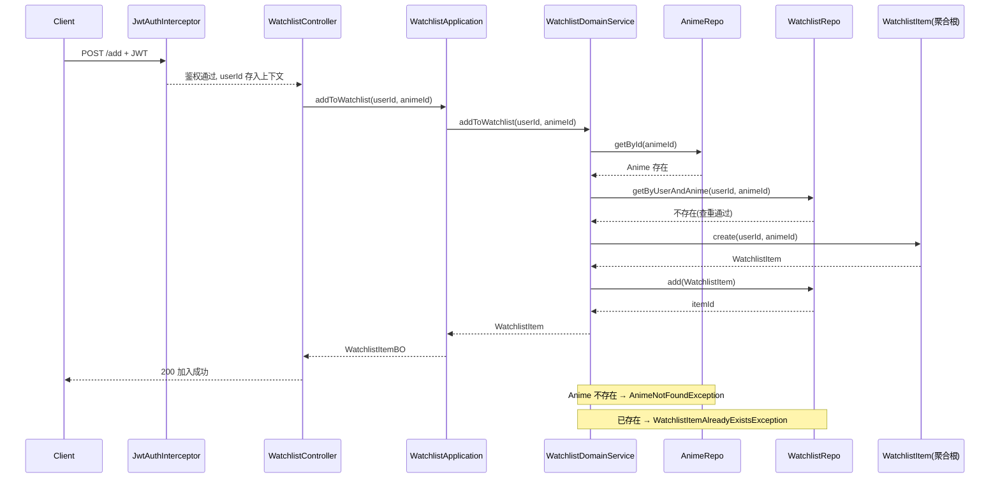
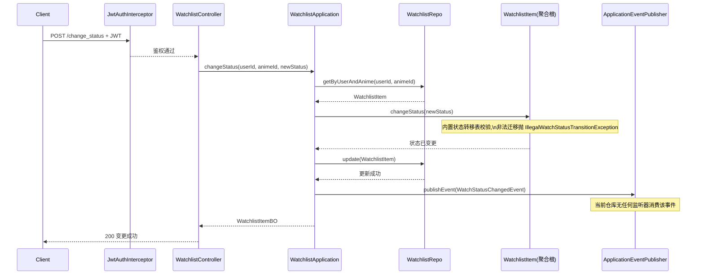
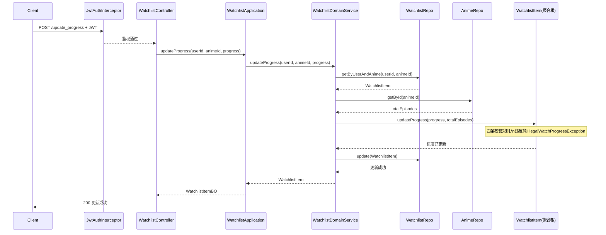
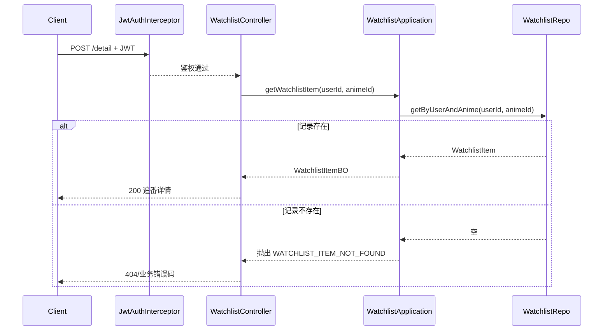
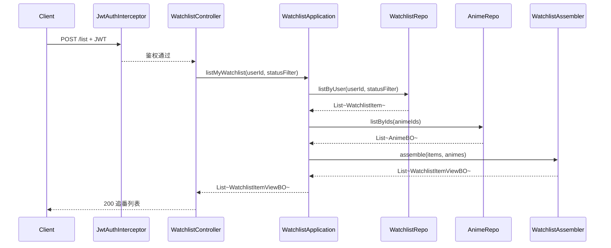

# anitrack 接口时序图

覆盖当前 3 个 Controller 共 9 个接口的调用链路,按上下文分组。图中省略了全局横切逻辑(`GlobalExceptionHandler` 统一异常处理),仅在鉴权环节体现 `JwtAuthInterceptor`。

## User 用户上下文

### 注册 `POST /api/user/register`

### 登录 `POST /api/user/login`

## Anime 番剧上下文

### 搜索并落库 `POST /api/anime/search`

### 查询详情 `POST /api/anime/detail`

## Watchlist 追番上下文

以下接口均先经过 `JwtAuthInterceptor` 鉴权,`userId` 取自 `UserContextHolder.getUserId()`。

### 加入追番 `POST /api/watchlist/add`

### 变更追看状态 `POST /api/watchlist/change_status`

### 更新观看进度 `POST /api/watchlist/update_progress`

### 查询单条追番记录 `POST /api/watchlist/detail`

### 查询我的追番列表 `POST /api/watchlist/list`

