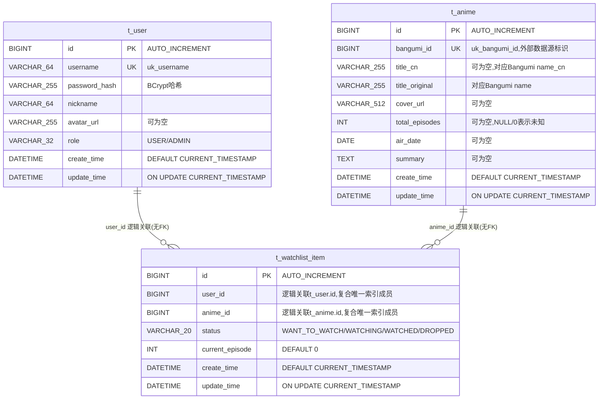

# anitrack 数据库 ER 图

当前已实现的表来自 Flyway 迁移脚本(`anitrack-starter/src/main/resources/db/migration/`):`V1__create_user_table.sql`、`V2__create_anime_table.sql`、`V3__create_watchlist_item_table.sql`,对应 PO 位于 `anitrack-infrastructure/.../dal/po/`。

**通用约定**:项目规则禁止使用外键(`docs/rules/anitrack-persist-rules.md`),表间关联均为逻辑关联,不存在物理约束,一致性由应用层保证。

## 表说明

| 表名 | 所属限界上下文 | 用途 |
| --- | --- | --- |
| `t_user` | `com.anitrack.domain.user` | 用户账号信息(登录凭证、角色) |
| `t_anime` | `com.anitrack.domain.anime` | 番剧目录本地缓存,数据源自 Bangumi API(经 ACL 转换) |
| `t_watchlist_item` | `com.anitrack.domain.watchlist` | 用户追番记录,是 `t_user` 与 `t_anime` 之间的关联表,承载状态与观看进度 |

## 关联关系

| 关联 | 关联字段 | 基数 | 约束方式 |
| --- | --- | --- | --- |
| `t_user` → `t_watchlist_item` | `t_watchlist_item.user_id` 逻辑指向 `t_user.id` | 一对多 | 应用层保证,无物理外键 |
| `t_anime` → `t_watchlist_item` | `t_watchlist_item.anime_id` 逻辑指向 `t_anime.id` | 一对多 | 应用层保证,无物理外键 |
| `t_user` ↔ `t_anime`(经 `t_watchlist_item`) | 间接关联 | 多对多,但每对 `(user_id, anime_id)` 至多一条记录 | 复合唯一索引 `uk_user_anime(user_id, anime_id)` |

## 未实现部分(仅设计规划,非当前库结构)

`review`(评分评论)、`community`(帖子/评论)限界上下文目前**没有落地的表结构、PO 或 domain 代码**,仅在 `docs/rules/anitrack-persist-rules.md` 与总体设计文档中作为后续规划提及(如规划中的 `t_review` 表同样会对 `(user_id, anime_id)` 建唯一索引)。待相关功能实施后再补充进本 ER 图。
